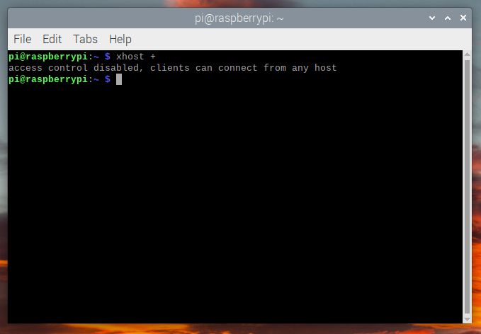

# 树莓派4B 安装opencv 及实时人脸检测 指导-- raspberry pi OS  version : 2021/10/30 , Based on Debian version 11 (bullseye) 


### 树莓派配置OpenCV教程以及遇到的问题

首先我使用命令： lsb_release -a ，查看当前树莓派系统版本，具体信息如下，此版本发布版是11,的代号为 “buster”,
目前清华大学的Raspbian 镜像版本要低于这个版本, 不要切换源, 否则 apt-get  update 和 apt-get  upgrade 一堆问题.


1. 安装OpenCV
（1）增大可用内存空间
```
sudo raspi-config
```


然后重启树莓派。
（2）安装CMake、图像和视频库
输入以下命令：
```
$ sudo apt-get install build-essential cmake git pkg-config
$ sudo apt-get install libjpeg-dev libpng-dev libtiff-dev
$ sudo apt-get install libavcodec-dev libavformat-dev libswscale-dev libv4l-dev
$ sudo apt-get install libxvidcore-dev libx264-dev
$ sudo apt-get install libgtk-3-dev
$ sudo apt-get install libcanberra-gtk*
$ sudo apt-get -y install libatlas-base-dev gfortran
```

然后在GitHub上下载OpenCV：
```
$ cd ~/
$ mkdir opencv
$ cd opencv
$ wget -O opencv.zip https://github.com/opencv/opencv/archive/4.0.0.zip
$ wget -O opencv_contrib.zip https://github.com/opencv/opencv_contrib/archive/4.0.0.zip

```

也可以直接在电脑上下载好了，再挪到树莓派里面。

然后解压并修改文件夹名称，如果不修改文件夹名称，记得修改后来的CMake路径：

```
$ unzip opencv.zip
$ unzip opencv_contrib.zip
$ mv opencv-4.0.0 opencv
$ mv opencv_contrib-4.0.0 opencv_contrib
```


(3)安装OpenCV  

```
$ cd opencv
$ mkdir build
$ cd build
$ cmake -D CMAKE_BUILD_TYPE=RELEASE \
    -D CMAKE_INSTALL_PREFIX=/usr/local \
    -D OPENCV_EXTRA_MODULES_PATH=~/opencv/opencv_contrib/modules \
    -D ENABLE_NEON=ON \
    -D ENABLE_VFPV3=ON \
    -D BUILD_TESTS=OFF \
    -D OPENCV_ENABLE_NONFREE=ON \
    -D INSTALL_PYTHON_EXAMPLES=OFF \
    -D CMAKE_SHARED_LINKER_FLAGS='-latomic' \
    -D BUILD_EXAMPLES=OFF ..
$ sudo make -j4
``` 
进行漫长的等待。。。等待。。。待。。。

能够正常编译到100%说明编译成功。

嗯，然后你应该会发现并不能编译成功。需要进行以下步骤：

https://pan.baidu.com/s/1xi6_5NuTFiP4SD649FgIJw 提取码：mbsj

将这里面所有.i文件复制到树莓派的opencv_contrib/modules/xfeatures2d/src/路径中。

再拷贝一下下面的文件：


  
在19%时候出现 `c++: error: unrecognized command-line option ‘--param=ipcp-unit-growth=100000’; did you mean ‘--param=ipa-cp-unit-growth=’?`
在github找issue [carotene: Replace ipcp-unit-growth with ipa-cp-unit-growth on gcc >= 10](https://github.com/opencv/opencv/pull/16369/commits/2bd94884752b9840d434f80b1c4b83176f7063e3)
修改2个文件路径:
`pi\opencv\build\3rdparty\carotene\hal\carotene\CMakeFiles\carotene_objs.dir\build.make`和 `pi\opencv\build\3rdparty\carotene\hal\carotene\CMakeFiles\carotene_objs.dir\flags.make`
把所有的`ipcp-unit-growth` 全部替换 `ipa-cp-unit-growth`.
再次编译:  

```
$ sudo make -j4
```

然后应该就能编译成功了orz。如果不能的话，据说？你的树莓派如果不是4G版本的话，需要在编译之前修改/etc/dphys-swapfile文件，将其中的CONF_SWAPSIZE改为2048，编译完了再改回去。  
接下来就是安装OpenCV：
````
$ sudo make install
$ sudo ldconfig
````

然后 命令`df -Th`发现 `/dev/root ` 已用容量100%, 清理空间,腾出 4g 空间.
```
$ sudo apt-get purge wolfram-engine
$ sudo apt-get purge libreoffice*
$ sudo apt-get clean
```

验证 `cv2` 是否安装好:
```
$ python3
>>> import cv2
ModuleNotFoundError: No Module named 'cv2'

```
查找 `sudo make install` 日志 或者重新执行 在 build 目录`sudo make install`,


发现`cv2` 安装目录`/usr/local/python` 
`/usr/local/python/cv2/python-3.9/cv2.cpython-39-arm-linux-gnueabihf.so` 在同级目录下 复制`cv2.so`

```
pi@raspberrypi:/usr/local/python/cv2/python-3.9 $ cp -r cv2.cpython-39-arm-linux-gnueabihf.so cv2.so
pi@raspberrypi:~ $ python3
Python 3.9.2 (default, Mar 12 2021, 04:06:34) 
[GCC 10.2.1 20210110] on linux
Type "help", "copyright", "credits" or "license" for more information.
>>> import sys
>>> sys.path
['', '/usr/lib/python39.zip', '/usr/lib/python3.9', '/usr/lib/python3.9/lib-dynload', '/usr/local/lib/python3.9/dist-packages', '/usr/lib/python3/dist-packages', '/usr/lib/python3.9/dist-packages']

```
根据`sys.path`在`/usr/lib/python3/dist-packages` 下建立一个`python3_path.pth`文件，并添加需要自定义包含引入的路径。
```
pi@raspberrypi:/usr/lib/python3/dist-packages $ cat python3_path.pth
/usr/local/python
```


继续验证 :
```
pi@raspberrypi:~ $ python3
Python 3.9.2 (default, Mar 12 2021, 04:06:34) 
[GCC 10.2.1 20210110] on linux
Type "help", "copyright", "credits" or "license" for more information.
>>> import sys
>>> sys.path
['', '/usr/lib/python39.zip', '/usr/lib/python3.9', '/usr/lib/python3.9/lib-dynload', '/usr/local/lib/python3.9/dist-packages', '/usr/lib/python3/dist-packages', '/usr/lib/python3.9/dist-packages']
>>> import cv2
>>> exit();

```

如果 `ModuleNotFoundError: No module named 'numpy'`  ,通过 `sudo pip3 install numpy` 安装numpy 即可 .
没有报错正常显示, 证明模块能正常导入.
继续验证功能:
新建一个 test.py 文件 .

```
import numpy as np
import cv2
 
cap = cv2.VideoCapture(0)
cap.set(3,640) # set Width
cap.set(4,480) # set Height
  
while(True):
    ret, frame = cap.read()
    gray = cv2.cvtColor(frame, cv2.COLOR_BGR2GRAY)
     
    cv2.imshow('frame', frame)
    cv2.imshow('gray', gray)
     
    k = cv2.waitKey(30) & 0xff
    if k == 27: # press 'ESC' to quit
        break
 
cap.release()
cv2.destroyAllWindows()

```
运行
```
pi@raspberrypi:~/test $ sudo python3 test.py 
Unable to init server: Could not connect: Connection refused

(gray:10658): Gtk-WARNING **: 21:42:37.914: cannot open display: localhost:10.0

```
最好通过 电脑远程桌面连接 到树莓派 . 在树莓派的控制台输入,,通过 xshell 连接好像不行.
```
pi@raspberrypi:~ $ xhost +

```

```
pi@raspberrypi:~/test $ sudo python3 test.py 
```
运行下面结果就可以.


[用树莓派实现实时的人脸检测]((https://shumeipai.nxez.com/2018/03/09/real-time-face-recognition-an-end-to-end-project-with-raspberry-pi.html),跟着这个就行 ,很详细.


> [清华大学开源软件镜像站](https://mirrors.tuna.tsinghua.edu.cn/help/raspbian/)  
> [树莓派配置OpenCV教程](https://blog.csdn.net/weixin_43905712/article/details/112131182)  
> [Python中的PYTHONPATH环境变量、手动添加import导入搜索路径](https://blog.csdn.net/DXCyber409/article/details/81029140?spm=1001.2101.3001.6650.1&utm_medium=distribute.pc_relevant.none-task-blog-2%7Edefault%7ECTRLIST%7Edefault-1.no_search_link&depth_1-utm_source=distribute.pc_relevant.none-task-blog-2%7Edefault%7ECTRLIST%7Edefault-1.no_search_link)  
> [linux 终端启动图形化程序界面时报错：No protocol specified](https://www.cnblogs.com/dorothychai/archive/2013/04/10/3011571.html)


