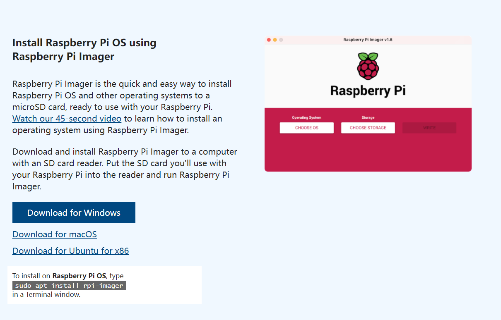
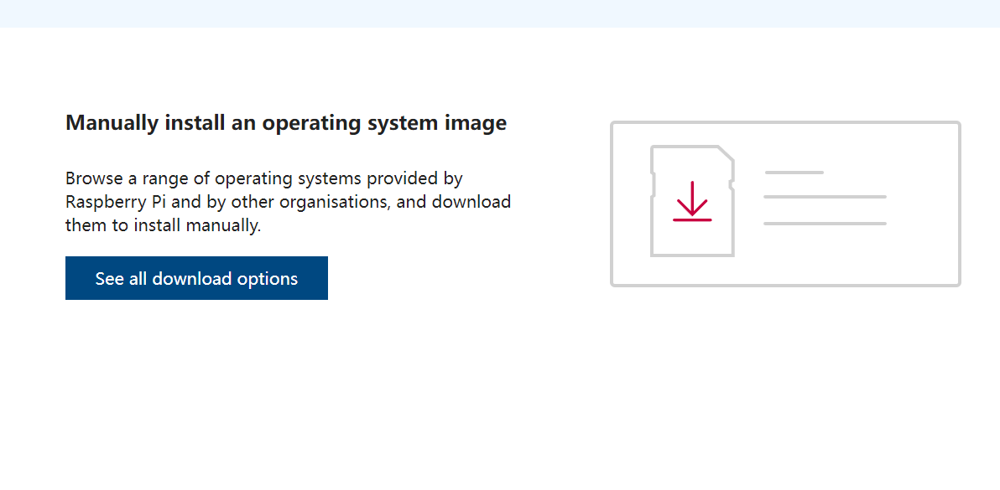
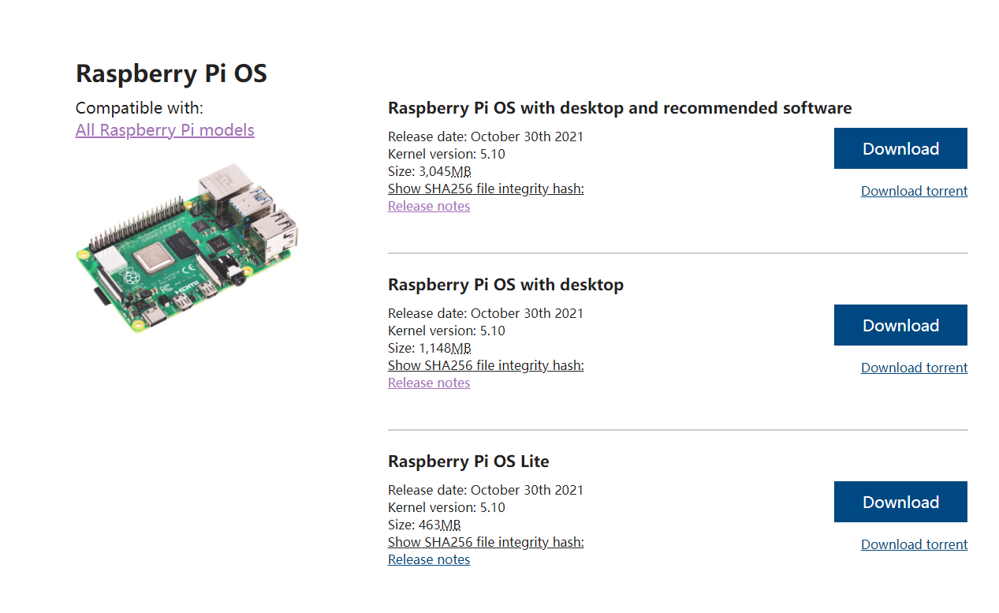
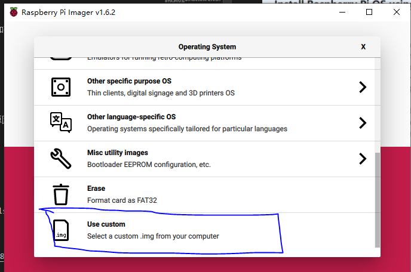
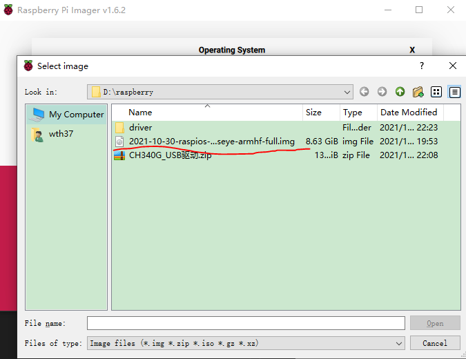
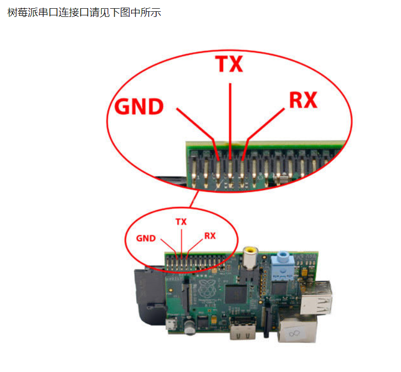
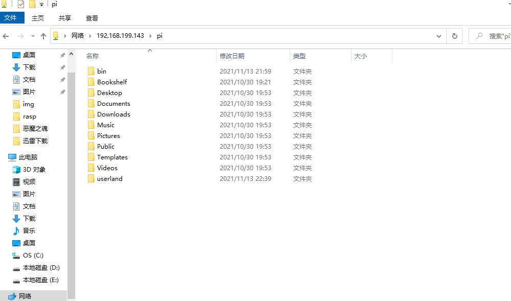
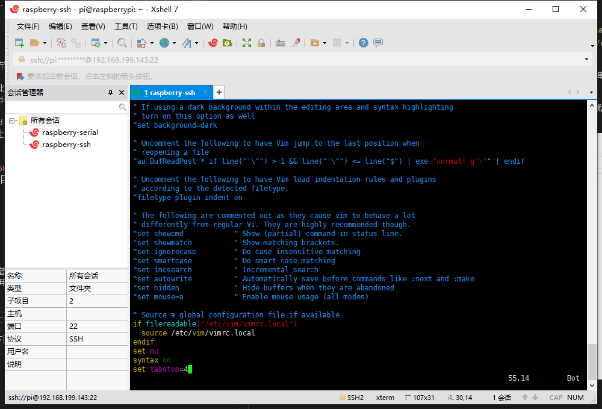
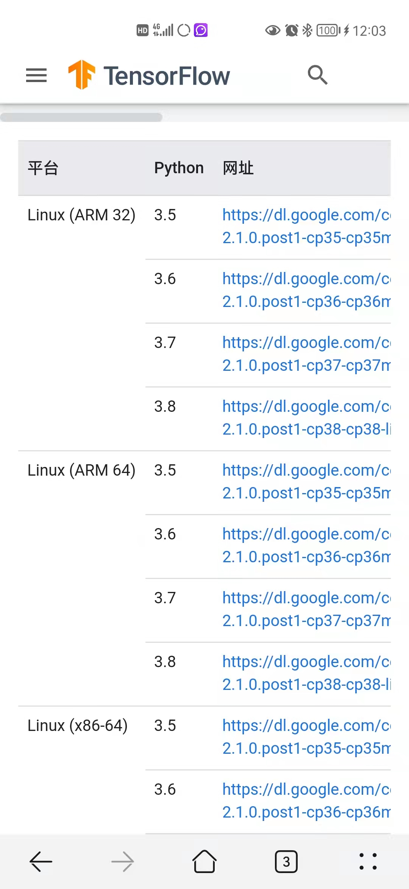
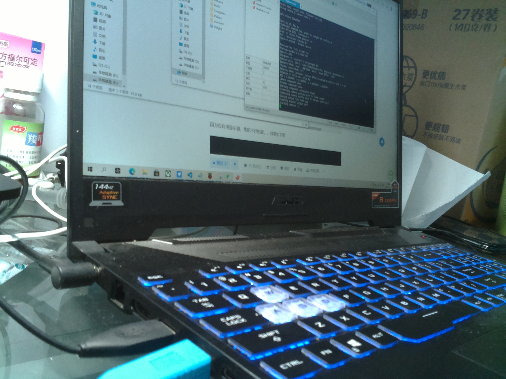

### 1. 烧录
安装`Raspberry Pi ` 系统，参考[官网](https://www.raspberrypi.com/software/)下载, 建议下载离线版本，这样使用迅雷等软件快速下载，并且多次刻录时候非常节省时间。

  
  
  
 
 
  
### 2. ttl
打开/boot/config.txt文件，找到如下配置语句使能串口，如果没有，可添加在文件最后面。
```
enable_uart=1

```    

ttl接口对应关系:

```
Raspberry       ttl线
GND             GND
TX              RXD
RX              TXD

```

 
 
 

### 3. config.txt

```
[all]
#打开串口
enable_uart=1
# 打开音频驱动
dtparam=i2c_arm=on
dtoverlay=i2s-soundcard
dtparam=i2s=on
# 打开摄像头驱动
start_x=1
gpu_mem=128
# 打开tft1.14ips显示屏（spi协议）
hdmi_force_hotplug=1
hdmi_cvt=576 324 60 1 0 0 0
hdmi_group=2
hdmi_mode=89
display_rotate=0

```  
### ssh 及 wifi连接  

> [【树莓派】树莓派安装与远程登录（使用SSH和远程桌面连接）](https://blog.csdn.net/iefenghao/article/details/88836303)

### 使用Windows自带的远程桌面软件来远程访问树莓派桌面
1. 安装Xrdp，执行如下命令：  
```
sudo apt-get install xrdp
```
2. 安装VNC服务，执行如下命令：
```
sudo apt-get install tightvncserver
```
3. 安装vnc4server tightvncserver
```
sudo apt-get install vnc4server tightvncserver
```
4. 启动Xrdp服务，执行如下命令：
```
sudo /etc/init.d/xrdp start
```
5. 将Xrdp服务添加到系统默认启动服务中。
```
sudo update-rc.d xrdp defaults
```

同时使用`sudo raspi-config`,更新 vnc 接口.


### 4. 更新软件源
Linux的软件不像Windows，基本都是需要在线安装的，但是树莓派由于各种原因其默认的软件源在国内速度并不是很理想，所以需要更新一下软件源：
```
sudo vi /etc/apt/sources.list

```

将默认的内容删掉或者用#号注释，改为


```
deb http://mirrors.tuna.tsinghua.edu.cn/raspbian/raspbian/ bullseye main contrib non-free rpi

```   

更新源命令:

```
sudo apt-get update 

```
> [树莓派（以及各种派）使用指南](https://zhuanlan.zhihu.com/p/77585297)  
> [raspberrypi - Operating system images](https://www.raspberrypi.com/software/operating-systems/)

#### 5.  使用 samba
通过 samba 服务，可以自由、访问修改树莓派家目录下的文件、代码。

首先安装 samba `sudo apt-get install samba samba-common-bin`

然后修改配置文件`sudo vi /etc/samba/smb.conf`

下面的配置是让用户可以访问自己的 home 目录。


配置用户可以读写自己的 home 目录，在`[homes]`节中，把 `read only = yes` 改为`read only = no` 。
找到`browseable=no`改为`yes`，否则等会访问时此文件夹会隐藏。
重启 samba 服务 `sudo /etc/init.d/samba-ad-dc restart`

把系统默认用户 pi 添加到 `sambasudo smbpasswd -a pi`
会提示你输入密码：建议跟串口登陆的密码一致，防止密码太多弄混了。

windows 访问
任意打开一个文件浏览器，输入 ip 地址:`\\192.168.199.143\pi`
现在就可以从其它机器上访问 pi 这个用户的 home 目录了。  

 


### vi/vim编辑器

linux常用的编辑工具有nano ,vi/vim（vim是vi的增强版）等。新手建议使用nano编辑器，简单易用。我个人则更加喜欢使用vi/vim编辑器，如果要使用vi编辑器首先得重新安装vi编辑器，因为树莓派自带的编辑器比较坑，谁用谁知道。

首先删除默认vi编辑器`sudo apt-get remove vim-common`,   然后重装vim
`sudo apt-get install vim`
为方便使用还得在`/etc/vim/vimrc`文件后面添加下面三句

```
set nu  #显示行号
syntax on  #语法高亮
set tabstop=4  #tab退四格
```
 

 vi有3个模式：插入模式、命令模式、低行模式。

    插入模式：在此模式下可以输入字符，按ESC将回到命令模式。

    命令模式：可以移动光标、删除字符等。

    低行模式：可以保存文件、退出vi、设置vi、查找等功能(低行模式也可以看作是命令模式里的)

打开文件、保存、关闭文件(vi命令模式下使用)

	vi filename     //打开filename文件

	:w                  //保存文件

	:q                  //退出编辑器，如果文件已修改请使用下面的命令

	:q!                 //退出编辑器，且不保存

	:wq               //退出编辑器，且保存文件


插入文本或行(vi命令模式下使用，执行下面命令后将进入插入模式，按ESC键可退出插入模式)

	a       //在当前光标位置的右边添加文本

	i        //在当前光标位置的左边添加文本

	A      //在当前行的末尾位置添加文本

	I       //在当前行的开始处添加文本(非空字符的行首)

	O     //在当前行的上面新建一行

	o     //在当前行的下面新建一行

	R     //替换(覆盖)当前光标位置及后面的若干文本

	J     //合并光标所在行及下一行为一行(依然在命令模式)

删除、恢复字符或行(vi命令模式下使用)


	x          //删除当前字符

	nx        //删除从光标开始的n个字符

	dd       //删除当前行

	ndd     //向下删除当前行在内的n行

	u         //撤销上一步操作

	U         //撤销对当前行的所有操作

复制、粘贴(vi命令模式下使用)

	yy      //将当前行复制到缓存区

    nyy    //将当前行向下n行复制到缓冲区

	yw     //复制从光标开始到词尾的字符

	nyw   //复制从光标开始的n个单词

	y^     //复制从光标到行首的内容

	y$     //复制从光标到行尾的内容

	p      //粘贴剪切板里的内容在光标后

	P      //粘贴剪切板里的内容在光标前

设置行号(vi命令模式下使用)

	:set  nu       //显示行号

	:set nonu    //取消显示行号

新手使用vi可能不习惯，慢慢的被虐多了就觉习惯了 。顺便提醒一句，linux系统是区分大小写的。另附vi/vim键盘图一张。

 

### Python3多版本安装及兼容
2021年10月30号更新的Raspberry Pi OS, `python`和`python3`版本如下:
```
pi@raspberrypi:~ $ python -V
Python 2.7.18
pi@raspberrypi:~ $ python3 -V
Python 3.9.2

```
由于tensorflow版本要低于`python 3.9.2`版本,所以需要重新安装`3.7.10`版本.
 

1.  通过主机下载[Python-3.7.10.tgz](https://www.python.org/ftp/python/3.7.10/Python-3.7.10.tgz),通过scmda方式在pc端上传`Python-3.7.10.tgz`到`\\192.168.199.143\pi`,

```
pi@raspberrypi:~ $ mkdir python3.7
# 把Python-3.7.10.tgz 移动到  python3.7里
pi@raspberrypi:~ $ ls
bin        Desktop    Downloads  Pictures  python3.7  test.jpg  Videos
Bookshelf  Documents  Music      Public    Templates  userland
pi@raspberrypi:~/python3.7 $ tar -zxvf Python-3.7.10.tgz
pi@raspberrypi:~/python3.7 $ ls
Python-3.7.10  Python-3.7.10.tgz
pi@raspberrypi:~/python3.7 $ cd Python-3.7.10/
pi@raspberrypi:~/python3.7 $ sudo apt-get install libffi-dev
pi@raspberrypi:~/python3.7 $ ./configure --prefix=/home/pi/python3.7^C
pi@raspberrypi:~/python3.7/Python-3.7.10 $ make
pi@raspberrypi:~/python3.7/Python-3.7.10 $ make install
pi@raspberrypi:~/python3.7/Python-3.7.10 $ cd ..
pi@raspberrypi:~/python3.7 $ cd bin/
pi@raspberrypi:~/python3.7/bin $ ls
2to3              idle3    pip3.7    python3           python3.7m         pyvenv
2to3-3.7          idle3.7  pydoc3    python3.7         python3.7m-config  pyvenv-3.7
easy_install-3.7  pip3     pydoc3.7  python3.7-config  python3-config
pi@raspberrypi:~/python3.7/bin $ ./python3.7 -V
Python 3.7.10
pi@raspberrypi:~ $ python3.7 -V
Python 3.7.10
pi@raspberrypi:~ $ python3 -V
Python 3.9.2


```


> [在Linux上安装Python3](https://www.cnblogs.com/lemon-feng/p/11208435.html)  
> [linux安装和卸载python3](https://www.cnblogs.com/leslie12956/p/13668097.html)

### TensorFlow Lite
Python 3.3以后自带venv模块支持轻量级虚拟环境，而virtualenv模块支持Python2和3两个版本。

```
pi@raspberrypi:~ $ python3.7  -m venv venvtest
pi@raspberrypi:~ $ ls
bin        Desktop    Downloads  Pictures  python3.7  test.jpg  venvtest
Bookshelf  Documents  Music      Public    Templates  userland  Videos
pi@raspberrypi:~ $ cd venvtest/
pi@raspberrypi:~/venvtest $ ls
bin  include  lib  pyvenv.cfg
pi@raspberrypi:~/venvtest $ cd bin
pi@raspberrypi:~/venvtest/bin $ ls
activate      activate.fish  easy_install-3.7  pip3    python   python3.7
activate.csh  easy_install   pip               pip3.7  python3
pi@raspberrypi:~ $ cd venvtest/
pi@raspberrypi:~/venvtest $ ls
bin  include  lib  pyvenv.cfg
pi@raspberrypi:~/venvtest $ cd bin
pi@raspberrypi:~/venvtest/bin $ ls
activate      activate.fish  easy_install-3.7  pip3    python   python3.7
activate.csh  easy_install   pip               pip3.7  python3
pi@raspberrypi:~/venvtest/bin $ cd ..
pi@raspberrypi:~/venvtest $ source bin/activate
(venvtest) pi@raspberrypi:~/venvtest $ python3
Python 3.7.10 (default, Nov 13 2021, 16:57:21) 
[GCC 10.2.1 20210110] on linux
Type "help", "copyright", "credits" or "license" for more information.
>>> exit();
# 注意：激活后的提示符会有(ENV)字样，表示切换了python环境
(venvtest) pi@raspberrypi:~/venvtest $ python
Python 3.7.10 (default, Nov 13 2021, 16:57:21) 
[GCC 10.2.1 20210110] on linux
Type "help", "copyright", "credits" or "license" for more information.
>>> exit();
##激活 
$ source ~/venvtest/bin/activate
# 取消激活
$ deactivate

```
安装 TensorFlow lite官网 https://www.tensorflow.org/lite/guide/python ，提供了多个版本，我们根据自己的版本，应该是选择Python 3.7 & ARM32 这个：

```
pi@raspberrypi:~ $ mkdir tflite 
mkdir: cannot create directory ‘tflite’: File exists
[1]+  Done                    mkdir tflite
pi@raspberrypi:~ $ cd tflite/
pi@raspberrypi:~/tflite $ source ~/venvtest/bin/activate
(venvtest) pi@raspberrypi:~/tflite $ python -V
Python 3.7.10

pi@raspberrypi:~ $ mkdir tflite 
pi@raspberrypi:~ $ cd tflite/
pi@raspberrypi:~/tflite $ source ~/venvtest/bin/activate
(venvtest) pi@raspberrypi:~/tflite $ python -V
Python 3.7.10
(venvtest) pi@raspberrypi:~/tflite $ git clone https://github.com/whgreate/pi4b_tensorflow_lite
(venvtest) pi@raspberrypi:~/tflite $ cd pi4b_tensorflow_lite
(venvtest) pi@raspberrypi:~/tflite/pi4b_tensorflow_lite $ pip install tflite_runtime-1.14.0-cp37-cp37m-linux_armv7l.whl 
(venvtest) pi@raspberrypi:~/tflite/pi4b_tensorflow_lite $ sudo apt-get install libatlas-base-dev
(venvtest) pi@raspberrypi:~/tflite/pi4b_tensorflow_lite $ sudo apt-get install libjpeg-dev
(venvtest) pi@raspberrypi:~/tflite/pi4b_tensorflow_lite $ pip install -r requirements.txt
(venvtest) pi@raspberrypi:~/tflite/pi4b_tensorflow_lite $ python label_image.py -m mobilenet_v1_1.0_224_quant.tflite -l labels_mobilenet_quant_v1_224.txt -i grace_hopper.bmp
INFO: Initialized TensorFlow Lite runtime.
0.658824: military uniform
0.149020: Windsor tie
0.039216: bow tie
0.027451: mortarboard
0.019608: bulletproof vest

```


### Docker安装

### 6. 摄像头

用`vcgencmd get_camera`监测 
```
support=0 detected=0
```
百度上均没有解决的答案, 直到去官网 [forum FAQ](https://forums.raspberrypi.com/app.php/help/faq)里,才发现这些页面原来最新的版本log中已经移除摄像头驱动[2021-10-30 release notes](https://downloads.raspberrypi.org/raspios_armhf/release_notes.txt):

```
2021-10-30:
* Based on Debian version 11 (bullseye)
[ .... ]
* New default camera subsystem based on libcamera
* New camera demo applications (libcamera-still and libcamera-vid) have replaced raspistill and raspivid

```

If there is a DESPERATE need to revert to the old camera stack, then it is possible.
- Edit /boot/config.txt, remove the line `"camera_auto_detect=1"`, and add `"start_x=1"` and `"gpu_mem=128"`. Rebooting at this stage will reload the old V4L2 driver. Stop at this point if that is sufficient for your needs.

修改`/boot/config.txt`,删除 `camera_auto_detect=1`,新增`start_x=1`和`gpu_mem=128`,如果继续想用使用摄像头功能,  继续操作 :


If you need raspistill/vid, then build the userland libraries for yourself.

```
Code: Select all

cd ~
sudo apt install cmake
mkdir bin
git clone https://github.com/raspberrypi/userland
cd userland
./buildme
cp build/bin/* ~/bin/

```  

If a "bin" directory exists in your home directory, then the default .profile adds it to your path, hence it will find these copies of the binaries.
If you need the binary accessible by all users, then copying them into /usr/local/bin would be the normal solution.

Note that with the graphics stack having been changed to be Full KMS by default, then the firmware can no longer a a preview display to the screen. Please use the -n option (for no preview), or edit /boot/config.txt again and change "dtoverlay=vc4-kms-v3d" to "dtoverlay=vc4-fkms-v3d".
Second note, this is still 32bit only. MMAL support on 64bit is still partially broken.

并将`/home/pi/bin`加入PATH

（1）`vim /etc/profile`

（2）按`“I”`，然后贴上下面内容：

```
### 其他配置
PATH=$PATH:/home/pi/bin

export PATH

```  

修改完记得执行行下面的命令，让上一步的修改生效

```
pi@raspberrypi:~$ source ./.profile 


```

启动命令：

`raspistill ` 生效。
``` 
pi@raspberrypi:~$ raspistill 

"raspistill" Camera App (commit bab9bf8790cd)

Runs camera for specific time, and take JPG capture at end if requested

usage: raspistill [options]

Image parameter commands

-q, --quality	: Set jpeg quality <0 to 100>
-r, --raw	: Add raw bayer data to jpeg metadata
-l, --latest	: Link latest complete image to filename <filename>
-t, --timeout	: Time (in ms) before takes picture and shuts down (if not specified, set to 5s)
-th, --thumb	: Set thumbnail parameters (x:y:quality) or none
-d, --demo	: Run a demo mode (cycle through range of camera options, no capture)
-e, --encoding	: Encoding to use for output file (jpg, bmp, gif, png)
-x, --exif	: EXIF tag to apply to captures (format as 'key=value') or none
-tl, --timelapse	: Timelapse mode. Takes a picture every <t>ms. %d == frame number (Try: -o img_%04d.jpg)
-fp, --fullpreview	: Run the preview using the still capture resolution (may reduce preview fps)
-k, --keypress	: Wait between captures for a ENTER, X then ENTER to exit
-s, --signal	: Wait between captures for a SIGUSR1 or SIGUSR2 from another process
-g, --gl	: Draw preview to texture instead of using video render component
-gc, --glcapture	: Capture the GL frame-buffer instead of the camera image

```

```
# vcgencmd 树莓派专有命令用来对硬件做各种检测，如下检查摄像头信息
$ vcgencmd get_camera

# 返回0，说明没有检测到摄像头信息
supported=0 detected=0
树莓派默认将摄像头通信关闭，此时需要开启：

# 运行命令行配置
$ sudo raspi-config
依次选择 "Interfacing Options" -> " Camera"，确定后重启树莓派。

``` 

此时再次执行以下命令，可以得到摄像头信息了!
``` 
$ vcgencmd get_camera
supported=1 detected=1

``` 

树莓派自带raspistill可以用来进行摄像头拍照功能，如下命令：
```
$ raspistill -v -o test.jpg

# 还有其他命令可以多试试，比如水平垂直翻转, 详细选项参考 https://www.cnblogs.com/jikexianfeng/p/7130843.html
$ raspistill -ifx pastel -hf -vf -o test.jpg 

```



> [Legacy camera stack under Bullseye](https://forums.raspberrypi.com/viewtopic.php?t=323390)  
> [在Linux上安装Python3](https://www.cnblogs.com/lemon-feng/p/11208435.html)  


### TFT(tft)显示屏

#[1.14inch LCD Module](https://www.waveshare.net/wiki/1.14inch_LCD_Module)


> [树莓派小白入门100讲](https://www.zhihu.com/column/c_1185191383811481600)


### 创建Python项目

````

# 可选，克隆我的github地址，包含所有的安装文件和训练模型
$ git clone https://github.com/whgreate/pi4b_tensorflow_lite && cd pi4b_tensorflow_lite

# 备用下载链接 git clone https://gitee.com/whgreate/pi4b_tensorflow_lite.git


# 安装tensorflow lite
$ pip install tflite_runtime-1.14.0-cp37-cp37m-linux_armv7l.whl 

Looking in indexes: https://pypi.org/simple, https://www.piwheels.org/simple
Processing ./tflite_runtime-1.14.0-cp37-cp37m-linux_armv7l.whl
Installing collected packages: tflite-runtime
Successfully installed tflite-runtime-1.14.0

# numpy pillow库需要的一些依赖
$ sudo apt-get install libatlas-base-dev
$ sudo apt-get install libjpeg-dev

# 安装 numpy pillow
$ pip install -r requirements.txt

# 备用
#  pip install -r requirements.txt -i https://mirrors.aliyun.com/pypi/simple

````


